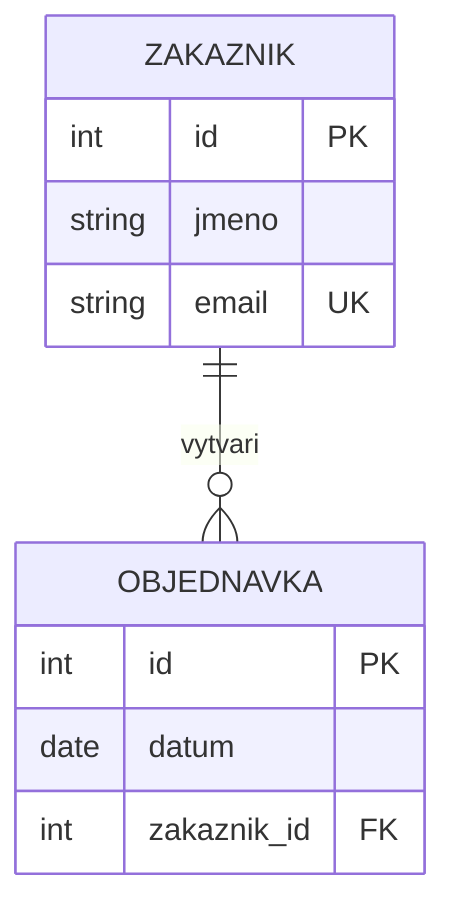
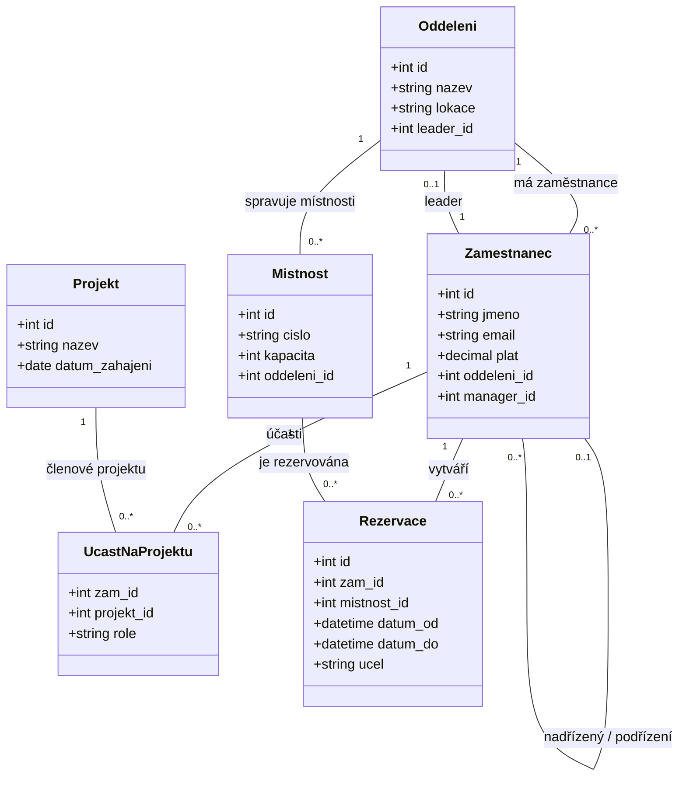

# 15 • ER model a návrh databáze

> **Formát:** 30 min praktická úloha, 15 min obhajoba + teorie. Praktika je **kreslení ER modelu na papír** podle textového zadání (žádný počítač). Pokrývá rekurzivní vazbu, vazbu 1:1 a M:N (databáze je "trošku vypečená" podle informací z minulých let).
> 

> 💡 **Tip k notaci**: Pro maturitu kresli notaci. Mermaid diagramy v tomhle souboru jsou jen pro čitelnost, na zkoušku potřebuješ umět to nakreslit rukou.
> 

---

# Část 1: Teorie

### Co je databáze

**Databáze** je organizovaný soubor dat, který umožňuje informace **ukládat, vyhledávat, upravovat a bezpečně spravovat**. Používá se v e-shopech, školních systémech, bankách, nemocnicích.

O správu se stará **DBMS** (Database Management System): MySQL, PostgreSQL, MS SQL Server, Oracle, SQLite, MariaDB.

### Proč nepoužívat ploché tabulky (Excel)

| Plochá data (Excel) | Relační databáze |
| --- | --- |
| Redundance (opakování) | Normalizovaná, žádné opakování |
| Nekonzistence (2 hodnoty si odporují) | Integritní omezení (FK, UNIQUE, CHECK) |
| Špatné vazby, obtížně se hlídají | FK constraints, referenční integrita |
| Konflikty (víc lidí přepíše současně) | Transakce, locking, MVCC |
| Žádná typová kontrola | Datové typy (`INT`, `VARCHAR`, `DATE`...) |

---

### 3 úrovně návrhu databáze

| Úroveň | Co řeší | Výstup |
| --- | --- | --- |
| **Konceptuální model** | *Co* chceme ukládat. Objekty a vztahy z reálného světa | ER diagram (entity + relace) |
| **Logický model** | Překlápí koncept do tabulek. Definuje PK, FK, propojení | Relační schéma |
| **Fyzický model** | Technické detaily pro konkrétní DBMS. Datové typy, indexy | `CREATE TABLE` skripty |

```
Konceptuální:   "Studenti mají třídu"  (kreslíme entity)
                       ▼
Logický:        Tabulka Student s FK trida_id → tabulka Trida.id
                       ▼
Fyzický:        CREATE TABLE Student (
                    id INT AUTO_INCREMENT PRIMARY KEY,
                    trida_id INT NOT NULL,
                    INDEX idx_trida (trida_id),
                    FOREIGN KEY (trida_id) REFERENCES Trida(id)
                );
```

---

### Klíčové pojmy ER modelu

| Pojem | Význam | Příklad |
| --- | --- | --- |
| **Data** | Jednotlivé hodnoty | "Anna", "25", "2026-05-11" |
| **Informace** | Data v souvislostech | "Zákaznice Anna, 25 let, registrovaná 2026-05-11" |
| **Entita** | Typ objektu reálného světa, o kterém vedeme záznamy | `Zakaznik`, `Produkt`, `Objednavka` |
| **Atribut** | Vlastnost entity | `jmeno`, `email`, `cena` |
| **Klíč** | Atribut(y), které jednoznačně identifikují záznam | `id_zakaznika` |
| **Relace (vazba)** | Vztah mezi entitami | Zákazník → Objednávka |
| **Kardinalita** | Kolik výskytů jedné entity souvisí s druhou | 1:1, 1:N, M:N |

> **Pozor na terminologii**: "Entita" je typ objektu (Student obecně), ne konkrétní záznam ("Karel Novák"). Konkrétnímu výskytu se říká **instance** entity. V ER diagramu kreslíš entity, ne instance.
> 

### Změna terminologie při přechodu na logický model

| Konceptuální (ER) | Logický (relační DB) |
| --- | --- |
| Entita | **Tabulka** |
| Atribut | **Sloupec (column)** |
| Relace (čára) | **Propojení přes klíče (FK)** |
| Instance | **Řádek (row)** |

---

### Klíče v relační databázi

```
                       ┌─────────────────┐
                       │     KLÍČE       │
                       └─────────────────┘
                              │
       ┌──────────────────────┼──────────────────────┐
       ▼                      ▼                      ▼
┌─────────────┐        ┌─────────────┐        ┌─────────────┐
│ Kandidátní  │        │   Cizí FK   │        │  Surrogate  │
│             │        │             │        │             │
│ ┌─────────┐ │        │ Odkaz na PK │        │ Auto-gen ID │
│ │Primární │ │        │ jiné tabulky│        │  (INT, GUID)│
│ │   PK    │ │        └─────────────┘        └─────────────┘
│ └─────────┘ │
│ Alternativní│
└─────────────┘
```

### Definice

| Klíč | Význam | Příklad |
| --- | --- | --- |
| **Kandidátní** | Sloupec(e), které **jednoznačně identifikují** záznam | `id_zakaznika`, `email` (oba unikátní) |
| **Primární (PK)** | **Vybraný** kandidátní klíč, `NOT NULL` + `UNIQUE` | `id_zakaznika` |
| **Alternativní** | Ostatní kandidátní klíče | `email` (taky unikátní) |
| **Cizí (FK)** | Odkaz na PK jiné tabulky, zajišťuje vazbu | `id_zakaznika` v tabulce `Objednavka` |
| **Surrogate** | Uměle vygenerované ID (auto-increment, GUID) | `id INT AUTO_INCREMENT` |
| **Přirozený** | Klíč vychází z reálného atributu | `rodne_cislo`, `ISBN` |
| **Složený** | PK z **více sloupců** (typicky vazební tabulka N:M) | `(id_studenta, id_predmetu)` |

### Surrogate vs přirozený klíč

| Surrogate (umělý) | Přirozený |
| --- | --- |
| Stabilní, nikdy se nemění | Může se změnit (změna jména) |
| Krátký (INT vs string) | Někdy dlouhý |
| Nemá business význam | Má smysl pro uživatele |
| **Doporučené pro většinu případů** | Když existuje přirozený stabilní (např. ISBN) |

> **Problém přirozených identifikátorů**: Rodné číslo se nabízí jako klíč, ale je to **citlivý údaj**, ne každý ho má validní (cizinci), a jeho zveřejnění může vést k bezpečnostnímu problému. Dnes se používají skoro výhradně **umělé klíče** (`id INT AUTO_INCREMENT` nebo GUID/CUID).
> 

---

### Kardinalita vazeb

### 1:1 (jeden ku jednomu)

```
ZAMESTNANEC ──────────── OBCANKA
   (1)                    (1)
```

Jeden zaměstnanec má jednu občanku, ta patří jen jemu.

**Implementace**: FK + `UNIQUE` v jedné z tabulek (volíme tu, kde se to víc hodí).

```sql
CREATE TABLE Uzivatel (
    id INT AUTO_INCREMENT PRIMARY KEY,
    login VARCHAR(50)
);
CREATE TABLE Profil (
    id INT AUTO_INCREMENT PRIMARY KEY,
    uzivatel_id INT NOT NULL UNIQUE,    -- UNIQUE dělá 1:1, jinak by bylo 1:N
    bio TEXT,
    FOREIGN KEY (uzivatel_id) REFERENCES Uzivatel(id)
);
```

> **Kdy 1:1 dává smysl** (oproti sloučení do jedné tabulky):
> 
> - Profilová data nečteš často (rozdělení pro výkon)
> - Profil je volitelný (nullable FK)
> - Profil má jiná oprávnění (zabezpečení)
> - Jeden záznam je velký (BLOB obrazu, dlouhý text)

### 1:N (jeden ku mnoha): **nejčastější**

```
ODDELENI ──────────< ZAMESTNANEC
  (1)                    (N)
```

Jedno oddělení má mnoho zaměstnanců, zaměstnanec patří do jednoho oddělení.

**Implementace**: FK **na straně N** (kde je "mnoho").

```sql
CREATE TABLE Oddeleni (
    id INT AUTO_INCREMENT PRIMARY KEY,
    nazev VARCHAR(50)
);
CREATE TABLE Zamestnanec (
    id INT AUTO_INCREMENT PRIMARY KEY,
    jmeno VARCHAR(50),
    oddeleni_id INT NOT NULL,           -- FK na straně N
    FOREIGN KEY (oddeleni_id) REFERENCES Oddeleni(id)
);
```

Příklady: Autor → Knihy, Kategorie → Produkty, Třída → Studenti.

### M:N (mnoho ku mnoha)

```
STUDENT >────────< PREDMET
   (M)              (N)
```

Student je zapsán na víc předmětů, předmět má víc studentů.

**Problém**: relační databáze tohle **napřímo neumí**. Musí se rozložit přes **vazební (spojovací) tabulku**.

```
STUDENT ───< ZAPIS >─── PREDMET
            (vazební)
```

```sql
CREATE TABLE Student (
    id INT AUTO_INCREMENT PRIMARY KEY,
    jmeno VARCHAR(50)
);
CREATE TABLE Predmet (
    id INT AUTO_INCREMENT PRIMARY KEY,
    nazev VARCHAR(50)
);
CREATE TABLE Zapis (
    student_id INT NOT NULL,
    predmet_id INT NOT NULL,
    datum_zapisu DATE,
    znamka VARCHAR(5),
    PRIMARY KEY (student_id, predmet_id),    -- složený PK
    FOREIGN KEY (student_id) REFERENCES Student(id),
    FOREIGN KEY (predmet_id) REFERENCES Predmet(id)
);
```

**Vlastnosti vazební tabulky**:

- PK = **složený klíč** `(student_id, predmet_id)`
- Dva cizí klíče na obě entity
- Může mít **vlastní atributy** (datum, známka, role...)

> **Klíčová věta pro obhajobu**: "M:N nelze v relační databázi implementovat napřímo, **vždy se rozkládá na dvě vazby 1:N přes vazební tabulku**."
> 

---

### Speciální typy vazeb

### Rekurzivní vazba (self-referencing)

Entita má vztah **sama na sebe**.

```
ZAMESTNANEC ──┐
     │        │  manager_id
     └────────┘
```

```sql
CREATE TABLE Zamestnanec (
    id INT AUTO_INCREMENT PRIMARY KEY,
    jmeno VARCHAR(50),
    manager_id INT NULL,                            -- NULL pro CEO
    FOREIGN KEY (manager_id) REFERENCES Zamestnanec(id)
);
```

**Příklady**:

- Zaměstnanec → nadřízený (manager)
- Komentář → odpověď (vlákno diskuse)
- Kategorie → nadřazená kategorie (strom)
- Stránka wiki → parent stránka

> **CEO má `manager_id = NULL`**, protože nemá nadřízeného. Proto `NULL` v rekurzivním FK je běžné.
> 

### Slabá entita

Entita **bez vlastního PK**, identifikuje se přes vztah k silné.

```
OBJEDNAVKA ──────|||─── POLOZKA
                (slabá entita)
```

```sql
CREATE TABLE Polozka (
    objednavka_id INT NOT NULL,
    poradi INT NOT NULL,
    nazev VARCHAR(100),
    PRIMARY KEY (objednavka_id, poradi),    -- PK složený z FK + diskriminátoru
    FOREIGN KEY (objednavka_id) REFERENCES Objednavka(id) ON DELETE CASCADE
);
```

Položka existuje **jen v rámci objednávky**, bez ní nedává smysl. Smaž objednávku, smažou se i položky (CASCADE).

### Vazba ISA (dědičnost)

"Něco je druhem něčeho." Příklad: Student ISA Osoba (Student je druh Osoby).

**Dvě cesty implementace**:

**1. Single Table Inheritance**: jedna velká tabulka se všemi sloupci

```sql
CREATE TABLE Osoba (
    id INT AUTO_INCREMENT PRIMARY KEY,
    typ VARCHAR(20),                    -- 'student' nebo 'ucitel'
    jmeno VARCHAR(50),
    -- studentské
    rocnik INT NULL,
    skupina VARCHAR(10) NULL,
    -- učitelské
    katedra VARCHAR(50) NULL,
    plat DECIMAL(10,2) NULL
);
```

Kdo není student, má v studentských sloupcích `NULL`. Jednoduché, ale plýtvá místem.

**2. Class Table Inheritance**: tabulka Osoba (společné) + tabulka Student (specifické), propojené 1:1

```sql
CREATE TABLE Osoba (
    id INT AUTO_INCREMENT PRIMARY KEY,
    jmeno VARCHAR(50)
);
CREATE TABLE Student (
    osoba_id INT PRIMARY KEY,           -- zároveň PK i FK
    rocnik INT,
    skupina VARCHAR(10),
    FOREIGN KEY (osoba_id) REFERENCES Osoba(id)
);
```

Čistější, ale potřebuje JOIN při čtení.

---

### Notace ER diagramů

### UML Class Diagram

V firmách kombinujících **datový model s objektovým návrhem** (ORM jako EF Core, Hibernate) se kreslí ER jako **UML class diagram**:

```
┌─────────────────────┐                           ┌─────────────────────┐
│     Zakaznik        │                           │     Objednavka      │
├─────────────────────┤   1                0..*   ├─────────────────────┤
│ - id : int {PK}     │ ────────────────────────► │ - id : int {PK}     │
│ - jmeno : string    │       "vytvari"           │ - datum : date      │
│ - email : string {U}│                           │ - stav : string     │
└─────────────────────┘                           │ - zakaznik_id : FK  │
                                                  └─────────────────────┘
```

**Multiplicita v UML**:

- `1`: právě jeden
- `0..1`: nula nebo jeden
- nebo `0..*`: nula a více
- `1..*`: jeden a více
- `n..m`: mezi n a m

### 4. Mermaid `erDiagram` (pro digitální dokumenty)



Hodí se pro Notion, GitHub README, Markdown obecně. **Na maturitu kreslíš rukou**, takže Mermaid potřebuješ jen pro vlastní přípravu.

---

### Která notace pro maturitu

| Notace | Kdy zvolit |
| --- | --- |
| **UML Class** | **Doporučení**, pokud kontextu vyhovuje objektový pohled |
| **Mermaid** | Jen pro vlastní digitální přípravu |
| Crow's Foot | klasická pro DB, kompaktní, snadné kreslení rukou |
| Chen | Pokud učitel vyloženě chce, jinak nepoužívat (zbytečně velká) |

> **Pro maturitu**: zvol UML a u kreslení **pojmenovávej vazby slovesem** ("vlastní", "patří k", "obsahuje"), pro entity podstatným jménem v jednotném čísle (`Zamestnanec`, ne `Zamestnanci`).
> 

---

### Převod ER → relační schéma

| ER konstrukt | Logický model |
| --- | --- |
| Entita | **Tabulka** |
| Atribut | **Sloupec** |
| Vazba **1:1** | FK + UNIQUE v jedné z tabulek |
| Vazba **1:N** | FK **na straně N** |
| Vazba **N:M** | Vazební tabulka + 2 FK + složený PK |
| Rekurzivní | FK na sebe samu (může být NULL) |
| Slabá entita | PK složený z FK + diskriminátor |
| ISA | Single table NULL, nebo Class table + 1:1 |

---

### Integritní omezení

| Omezení | Co dělá | SQL |
| --- | --- | --- |
| **Doménová** | Hodnota odpovídá typu / pravidlu | `INT`, `VARCHAR(50)`, `CHECK (vek >= 0)` |
| **Entitní** | Každý záznam má unikátní identifikaci | `PRIMARY KEY` |
| **Referenční** | Cizí klíč ukazuje na existující záznam | `FOREIGN KEY` |
| **Uživatelská** | Business pravidla | Triggery, kontroly v aplikaci |

### `ON DELETE` chování FK

```sql
FOREIGN KEY (zakaznik_id) REFERENCES Zakaznik(id) ON DELETE CASCADE
```

| Akce | Co dělá při smazání rodiče |
| --- | --- |
| `CASCADE` | Smaže i dceřiné záznamy (smaž zákazníka → smaž jeho objednávky) |
| `RESTRICT` | **Zakáže** smazání, pokud existují vazby (bezpečnější default) |
| `SET NULL` | Vynuluje FK na `NULL` (orphaned) |
| `SET DEFAULT` | Nastaví default hodnotu |
| `NO ACTION` | Stejné jako RESTRICT (kontrola na konci transakce) |

> **Pravidlo**: `CASCADE` použij jen tam, kde **dceřiný záznam bez rodiče nedává smysl** (položka objednávky bez objednávky). Pro většinu vazeb je bezpečnější `RESTRICT` nebo `SET NULL`.
> 

---

### Cyklus FK (klasický problém)

> **Pozor, jeden z chytáků z otázek k zamyšlení.**
> 

Zvaž situaci: `Oddeleni` má `leader_id` (FK na Zamestnanec) a `Zamestnanec` má `oddeleni_id` (FK na Oddeleni). **Cyklus FK!**

```
ODDELENI.leader_id ──────► ZAMESTNANEC.id
                                  │
ZAMESTNANEC.oddeleni_id ──► ODDELENI.id
                                 
                                 
                          cyklus!
```

**Problém**: Když chceš vytvořit oddělení i prvního zaměstnance, který je leader, **nelze**:

- Nejdřív Oddeleni → potřebuje `leader_id`, který ještě neexistuje
- Nejdřív Zamestnanec → potřebuje `oddeleni_id`, které ještě neexistuje

**Řešení 1: Nullable FK**

```sql
CREATE TABLE Oddeleni (
    id INT AUTO_INCREMENT PRIMARY KEY,
    nazev VARCHAR(50),
    leader_id INT NULL,                                     -- nullable!
    FOREIGN KEY (leader_id) REFERENCES Zamestnanec(id)
);
```

Postup:

1. Insert `Oddeleni` s `leader_id = NULL`
2. Insert `Zamestnanec` s `oddeleni_id = <nove_oddeleni>`
3. UPDATE `Oddeleni` SET `leader_id = <novy_zamestnanec>` WHERE `id = ...`

**Řešení 2: DEFERRABLE constraints (PostgreSQL)**

```sql
FOREIGN KEY (leader_id) REFERENCES Zamestnanec(id) DEFERRABLE INITIALLY DEFERRED
```

DEFERRABLE constraint se kontroluje až na konci transakce, takže lze v transakci vložit oba záznamy v jakémkoliv pořadí.

**Řešení 3**: Refactor: leader_id nebýt v Oddeleni, místo toho mít `je_leader: BOOLEAN` v Zamestnanec.

---

### Normalizace (1NF, 2NF, 3NF)

**Cíl**: Odstranit zbytečné opakování a anomálie (insert/update/delete).

### 1NF: atomicita

> Každý atribut obsahuje **atomickou hodnotu** (žádné seznamy v jedné buňce).
> 

❌ **Špatně**:

| id | jmeno | telefony |
| --- | --- | --- |
| 1 | Anna | "123123123, 456456456, 733330620" |

✓ **Správně**: vytáhnout do samostatné tabulky `Telefon` s FK na zákazníka (1:N).

### 2NF: závislost na celém PK

> Tabulka je v 1NF + neklíčové atributy závisejí **na celém složeném PK**, ne jen na části.
> 

❌ **Špatně** (PK = `(student_id, predmet_id)`):

| student_id | predmet_id | znamka | jmeno_studenta |
| --- | --- | --- | --- |
| 1 | 10 | 1 | Anna |

`jmeno_studenta` závisí jen na `student_id`, ne na celém PK.

✓ **Správně**: přesunout `jmeno_studenta` do tabulky `Student`.

### 3NF: žádné tranzitivní závislosti

> Tabulka je v 2NF + neklíčové atributy **nezávisí** na jiných neklíčových atributech.
> 

❌ **Špatně**:

| id_zamestnance | jmeno | id_oddeleni | nazev_oddeleni |
| --- | --- | --- | --- |

`nazev_oddeleni` závisí na `id_oddeleni` (ne na PK `id_zamestnance`).

✓ **Správně**: vyhodit `nazev_oddeleni` z `Zamestnanec`, držet ho jen v tabulce `Oddeleni`.

> **Denormalizace**: někdy se 3NF schválně poruší pro výkon (data warehouse, reporty). Trade-off mezi konzistencí (normalized) a rychlostí (denormalized).
> 

---

### Postup návrhu krok za krokem

```
1. Sběr požadavků
   "Co potřebuje uživatel uchovávat?"
        │
        ▼
2. Identifikace ENTIT (podstatná jména v zadání)
   "zaměstnanec", "oddělení", "projekt"
        │
        ▼
3. Atributy + PK pro každou entitu
   Zamestnanec: id, jmeno, email, plat
        │
        ▼
4. Vztahy + kardinalita (slovesa: patří, vede, rezervuje)
   "zaměstnanec PATŘÍ DO oddělení"  → 1:N
        │
        ▼
5. Doplnění FK (1:N → FK na straně N)
   Zamestnanec.oddeleni_id → Oddeleni.id
        │
        ▼
6. Vazební tabulky pro N:M
   UcastNaProjektu (zamestnanec_id, projekt_id, role)
        │
        ▼
7. Normalizace (1NF, 2NF, 3NF kontrola)
        │
        ▼
8. ER diagram (Crow's Foot)
        │
        ▼
9. CREATE TABLE v SQL
```

---

### Časté chyby

| Chyba | Důsledek |  Řešení |
| --- | --- | --- |
| Pletení entity a atributu | Špatný návrh | Entita = celý objekt, atribut = vlastnost |
| Více hodnot v jednom sloupci ("tel1, tel2") | Porušení 1NF | Vytáhnout do samostatné tabulky |
| Zapomenutí vazební tabulky u N:M | Nelze implementovat | Vždy spojovací tabulka se 2 FK |
| Chybějící PK | Nelze identifikovat řádek | Vždy `id INT AUTO_INCREMENT PRIMARY KEY` |
| Duplicitní data v různých tabulkách | Nekonzistence | 3NF, držet info na jednom místě |
| `ON DELETE CASCADE` všude | Nečekané ztráty dat | Promyslet, `RESTRICT` je často bezpečnější |
| FK bez indexu | Pomalé JOINy | DB většinou indexuje PK, ne FK, **přidat ručně** |
| Nepoužívání `NOT NULL` | NULL hodnoty na nečekaných místech | Co je povinné, dej `NOT NULL` |
| Přílišná normalizace | Pomalé JOINy, denormalize pro výkon | OLTP: 3NF, OLAP: denormalize |
| Přirozený klíč (rodné číslo) jako PK | Citlivý údaj, nestabilní | Surrogate `id INT AUTO_INCREMENT` |
| Cyklus FK bez nullable | Nelze vložit první záznam | Nullable FK nebo DEFERRABLE |

---

## Část 2: Praktická úloha

### Co může praktická úloha obsahovat

Podle informací z minulých let: **kreslení ER modelu na papír** podle textového zadání. Bez počítače, jen tužka a papír. Databáze bude obsahovat:

- **Rekurzivní vztah** (např. zaměstnanec → nadřízený)
- **Vazba 1:1** (např. oddělení → leader)
- **Vazba M:N** (např. zaměstnanec ↔ projekt s rolí ve vazební tabulce)

### Příklad zadání: Firemní databáze

Navrhni databázi pro firmu s následujícími požadavky:

- **Zaměstnanec + Oddělení**: zaměstnanec patří do jednoho oddělení (1:N). Oddělení má **leadera** (1:1 vazba na zaměstnance).
- **Projekt + Role**: zaměstnanec pracuje na více projektech, projekt má více lidí (**N:M**). Vazební tabulka má atribut `role` ("developer", "tester", "PM").
- **Rekurzivní vazba**: zaměstnanec má nadřízeného (taky zaměstnance), `manager_id` na sebe samu.
- **Místnost**: místnost patří k nadřazenému oddělení (1:N).
- **Rezervační systém**: zaměstnanec si rezervuje místnosti (s časem od/do), **N:M**.

### Řešení (kompletní)

### Verze pro papírové kreslení (Crow's Foot)



### SQL CREATE TABLE skripty

```sql
-- 1) Oddeleni (s nullable leader_id kvůli cyklu FK)
CREATE TABLE Oddeleni (
    id INT AUTO_INCREMENT PRIMARY KEY,
    nazev VARCHAR(50) NOT NULL,
    lokace VARCHAR(100),
    leader_id INT NULL UNIQUE                       -- UNIQUE dělá 1:1
    -- FK přidáme později, kvůli cyklu (po vytvoření Zamestnanec)
);

-- 2) Zamestnanec (rekurze + 1:N s Oddeleni)
CREATE TABLE Zamestnanec (
    id INT AUTO_INCREMENT PRIMARY KEY,
    jmeno VARCHAR(50) NOT NULL,
    prijmeni VARCHAR(50) NOT NULL,
    email VARCHAR(120) UNIQUE,
    plat DECIMAL(10, 2),
    oddeleni_id INT NOT NULL,
    manager_id INT NULL,                            -- NULL pro CEO
    FOREIGN KEY (oddeleni_id) REFERENCES Oddeleni(id) ON DELETE RESTRICT,
    FOREIGN KEY (manager_id) REFERENCES Zamestnanec(id) ON DELETE SET NULL
);

-- Doplníme FK na leader_id (cyklus)
ALTER TABLE Oddeleni
    ADD FOREIGN KEY (leader_id) REFERENCES Zamestnanec(id) ON DELETE SET NULL;

-- 3) Projekt
CREATE TABLE Projekt (
    id INT AUTO_INCREMENT PRIMARY KEY,
    nazev VARCHAR(100) NOT NULL,
    datum_zahajeni DATE NOT NULL,
    datum_ukonceni DATE NULL
);

-- 4) Ucast na projektu (N:M vazební tabulka)
CREATE TABLE UcastNaProjektu (
    zamestnanec_id INT NOT NULL,
    projekt_id INT NOT NULL,
    role VARCHAR(50) NOT NULL,
    PRIMARY KEY (zamestnanec_id, projekt_id),       -- složený PK
    FOREIGN KEY (zamestnanec_id) REFERENCES Zamestnanec(id) ON DELETE CASCADE,
    FOREIGN KEY (projekt_id) REFERENCES Projekt(id) ON DELETE CASCADE
);

-- 5) Mistnost (1:N s Oddeleni)
CREATE TABLE Mistnost (
    id INT AUTO_INCREMENT PRIMARY KEY,
    cislo VARCHAR(10) NOT NULL,
    kapacita INT,
    oddeleni_id INT,
    FOREIGN KEY (oddeleni_id) REFERENCES Oddeleni(id) ON DELETE SET NULL
);

-- 6) Rezervace (N:M Zamestnanec ↔ Mistnost)
CREATE TABLE Rezervace (
    id INT AUTO_INCREMENT PRIMARY KEY,
    zamestnanec_id INT NOT NULL,
    mistnost_id INT NOT NULL,
    datum_od DATETIME NOT NULL,
    datum_do DATETIME NOT NULL,
    ucel VARCHAR(200),
    FOREIGN KEY (zamestnanec_id) REFERENCES Zamestnanec(id) ON DELETE CASCADE,
    FOREIGN KEY (mistnost_id) REFERENCES Mistnost(id) ON DELETE CASCADE,
    CHECK (datum_od < datum_do)                     -- Bonus A
)classDiagram
    class Oddeleni {
        +int id
        +string nazev
        +string lokace
        +int leader_id
    }

    class Zamestnanec {
        +int id
        +string jmeno
        +string email
        +decimal plat
        +int oddeleni_id
        +int manager_id
    }

    class Projekt {
        +int id
        +string nazev
        +date datum_zahajeni
    }

    class UcastNaProjektu {
        +int zam_id
        +int projekt_id
        +string role
    }

    class Mistnost {
        +int id
        +string cislo
        +int kapacita
        +int oddeleni_id
    }

    class Rezervace {
        +int id
        +int zam_id
        +int mistnost_id
        +datetime datum_od
        +datetime datum_do
        +string ucel
    }

    Oddeleni "1" --> "0..*" Zamestnanec : má zaměstnance
    Oddeleni "1" --> "0..*" Mistnost : spravuje místnosti

    Oddeleni "0..1" --> "1" Zamestnanec : leader

    Zamestnanec "0..1" --> "0..*" Zamestnanec : nadřízený / podřízení

    Zamestnanec "1" --> "0..*" UcastNaProjektu : účasti
    Projekt "1" --> "0..*" UcastNaProjektu : členové projektu

    Zamestnanec "1" --> "0..*" Rezervace : vytváří
    Mistnost "1" --> "0..*" Rezervace : je rezervována
```

### SELECT dotazy

**(a) Zaměstnanci v oddělení "IT" a jejich manažeři:**

```sql
SELECT
    z.jmeno,
    z.prijmeni,
    m.jmeno AS manager_jmeno,
    m.prijmeni AS manager_prijmeni
FROM Zamestnanec z
INNER JOIN Oddeleni o ON z.oddeleni_id = o.id
LEFT JOIN Zamestnanec m ON z.manager_id = m.id        -- LEFT pro CEO (NULL manager)
WHERE o.nazev = 'IT';
```

**(b) Počet zaměstnanců na každém projektu:**

```sql
SELECT
    p.nazev,
    COUNT(u.zamestnanec_id) AS pocet_zamestnancu
FROM Projekt p
LEFT JOIN UcastNaProjektu u ON p.id = u.projekt_id
GROUP BY p.id, p.nazev
ORDER BY pocet_zamestnancu DESC;
```

**(c) Dnešní rezervace místností:**

```sql
SELECT
    z.jmeno,
    z.prijmeni,
    m.cislo AS mistnost,
    r.datum_od,
    r.datum_do,
    r.ucel
FROM Rezervace r
INNER JOIN Zamestnanec z ON r.zamestnanec_id = z.id
INNER JOIN Mistnost m ON r.mistnost_id = m.id
WHERE DATE(r.datum_od) = CURRENT_DATE
ORDER BY r.datum_od;
```

---

### Bonusy

### Bonus A: `CHECK (datum_od < datum_do)`

Už v `CREATE TABLE Rezervace` výše. Brání nesmyslným rezervacím typu "od 14:00 do 13:00".

### Bonus B: `ON DELETE` strategie

Promyšlené strategie pro každou FK:

| FK | Strategie | Důvod |
| --- | --- | --- |
| `Zamestnanec.oddeleni_id` | `RESTRICT` | Nesmazej oddělení, dokud má zaměstnance (nutí přesunout je jinam) |
| `Zamestnanec.manager_id` | `SET NULL` | Když odejde manažer, podřízení nezmizí, jen ztratí manažera |
| `Oddeleni.leader_id` | `SET NULL` | Když odejde leader, oddělení nezmizí, jen má `NULL` leader |
| `UcastNaProjektu.zamestnanec_id` | `CASCADE` | Zaměstnanec smazán → vymazat jeho účasti |
| `UcastNaProjektu.projekt_id` | `CASCADE` | Projekt smazán → vymazat účasti |
| `Mistnost.oddeleni_id` | `SET NULL` | Oddělení smazáno, místnost zůstane bez přiřazení |
| `Rezervace.zamestnanec_id` | `CASCADE` | Zaměstnanec smazán → smaž jeho rezervace |
| `Rezervace.mistnost_id` | `CASCADE` | Místnost smazána → smaž její rezervace |

### Bonus C: Kontrola překryvu rezervací

Najdi rezervace stejné místnosti, které se časově překrývají:

```sql
SELECT
    r1.id AS rezervace_1,
    r2.id AS rezervace_2,
    m.cislo AS mistnost,
    r1.datum_od, r1.datum_do,
    r2.datum_od, r2.datum_do
FROM Rezervace r1
INNER JOIN Rezervace r2
    ON r1.mistnost_id = r2.mistnost_id
    AND r1.id < r2.id                        -- aby se nepárovaly samy se sebou a duplicitně
INNER JOIN Mistnost m ON r1.mistnost_id = m.id
WHERE r1.datum_od < r2.datum_do              -- klasický overlap check
    AND r2.datum_od < r1.datum_do;
```

> **Overlap formule**: dva intervaly `[a1, b1]` a `[a2, b2]` se překrývají právě tehdy, když `a1 < b2 AND a2 < b1`.
> 

### Bonus D: Rekurzivní dotaz (všichni podřízení manažera)

PostgreSQL/MySQL 8+:

```sql
WITH RECURSIVE Podrizeni AS (
    -- Anchor: přímí podřízení daného manažera (např. id = 67)
    SELECT id, jmeno, prijmeni, manager_id, 1 AS uroven
    FROM Zamestnanec
    WHERE manager_id = 67

    UNION ALL

    -- Recursive: podřízení podřízených
    SELECT z.id, z.jmeno, z.prijmeni, z.manager_id, p.uroven + 1
    FROM Zamestnanec z
    INNER JOIN Podrizeni p ON z.manager_id = p.id
)
SELECT * FROM Podrizeni
ORDER BY uroven, prijmeni;
```

CTE `WITH RECURSIVE` projde celý strom podřízenosti.

### Bonus E: Součet platů na oddělení

```sql
SELECT
    o.nazev,
    SUM(z.plat) AS celkove_naklady,
    AVG(z.plat) AS prumerny_plat,
    COUNT(*) AS pocet_zamestnancu
FROM Oddeleni o
INNER JOIN Zamestnanec z ON o.id = z.oddeleni_id
GROUP BY o.id, o.nazev
ORDER BY celkove_naklady DESC;
```

---

### Co se v řešení děje

**Schéma má 6 tabulek**: Oddeleni, Zamestnanec, Projekt, UcastNaProjektu (vazební), Mistnost, Rezervace (vazební).

**Klíčové vazby**:

1. **1:N**: `Oddeleni → Zamestnanec` (FK `oddeleni_id` v Zamestnanec)
2. **1:1**: `Oddeleni → Zamestnanec leader` (FK `leader_id` v Oddeleni s `UNIQUE`)
3. **Rekurzivní 1:N**: `Zamestnanec → Zamestnanec manager` (FK `manager_id`, nullable pro CEO)
4. **N:M**: `Zamestnanec ↔ Projekt` přes `UcastNaProjektu` (složený PK)
5. **1:N**: `Oddeleni → Mistnost` (FK `oddeleni_id` v Mistnost)
6. **N:M**: `Zamestnanec ↔ Mistnost` přes `Rezervace` (s atributy datum_od, datum_do, ucel)

**Cyklus FK Oddeleni ↔ Zamestnanec**: vyřešen tím, že `leader_id` je **nullable**. Při vkládání:

1. Insert Oddeleni s `leader_id = NULL`
2. Insert Zamestnanec s `oddeleni_id = X`
3. UPDATE Oddeleni SET `leader_id = Y`

Plus FK na `leader_id` přidáno přes `ALTER TABLE` po vytvoření Zamestnanec.

**`ON DELETE` strategie** jsou promyšlené (Bonus B): RESTRICT pro chráněné vazby (oddělení s zaměstnanci), SET NULL pro volitelné (manager, leader), CASCADE pro silné vazby (účast na projektu, rezervace).

**`CHECK (datum_od < datum_do)`** brání nesmyslným rezervacím už na úrovni databáze.

---

## Část 3: Tipy pro obhajobu

### Co u obhajoby říct

> *"V zadání jsem nakreslil ER model firmy se 6 entitami. Oddělení a Zaměstnanec mají vztah 1:N, zaměstnanec patří do jednoho oddělení. Mezi nimi je i 1:1 vazba pro leadera oddělení, kterou jsem implementoval cizím klíčem leader_id v Oddělení s UNIQUE omezením. To je tady cyklus FK - Oddělení odkazuje na Zaměstnance a naopak. Vyřešil jsem to tak, že leader_id je nullable, takže lze nejdřív vložit oddělení s leader_id NULL, pak zaměstnance s oddeleni_id, a teprve potom UPDATE leadera. Rekurzivní vazba je u Zaměstnance manager_id, který odkazuje na Zamestnanec.id, NULL pro CEO. Vazba zaměstnanců na projekty je M:N s rolí (developer, tester, PM), takže jsem udělal vazební tabulku UcastNaProjektu se složeným PK ze dvou FK. Rezervace místností jsou taky M:N (zaměstnanec rezervuje místnost s časem od/do), ale tabulka má vlastní surrogate id, protože stejná dvojice se může opakovat v různých časech. Use case CHECK omezení (datum_od < datum_do) brání nesmyslným rezervacím přímo na úrovni databáze. ON DELETE strategie jsem promyslel: oddělení nelze smazat dokud má zaměstnance (RESTRICT), manager_id se vynuluje při odchodu manažera (SET NULL), rezervace se kaskádově smažou se zaměstnancem (CASCADE)."*
> 

### Klíčové pojmy pro teorii

| Pojem | Rychlá odpověď |
| --- | --- |
| **Databáze** | Organizovaná data spravovaná DBMS |
| **DBMS** | Systém pro správu DB: MySQL, PostgreSQL, Oracle |
| **ER model** | Konceptuální model: entity + atributy + vazby |
| **Entita** | Typ objektu reálného světa (tabulka) |
| **Atribut** | Vlastnost entity (sloupec) |
| **Instance** | Konkrétní výskyt entity (řádek) |
| **Kandidátní klíč** | Sloupec/sloupce identifikující záznam |
| **Primární klíč (PK)** | Vybraný kandidátní, NOT NULL + UNIQUE |
| **Cizí klíč (FK)** | Odkaz na PK jiné tabulky |
| **Surrogate klíč** | Umělé ID (AUTO_INCREMENT, GUID) |
| **Přirozený klíč** | Z reálného atributu (ISBN, rodné číslo) |
| **Složený PK** | PK z víc sloupců (vazební tabulka) |
| **Kardinalita** | 1:1, 1:N, M:N |
| **Vazební tabulka** | Pro M:N, 2 FK + složený PK |
| **Rekurzivní vazba** | Entita odkazuje sama na sebe |
| **Slabá entita** | Bez vlastního PK, identifikuje se přes rodiče |
| **ISA vazba** | Dědičnost ("Student je druh Osoby") |
| **Crow's Foot** | Notace ER, vrabčí stopa pro N |
| **1NF** | Atomické hodnoty, žádné seznamy |
| **2NF** | 1NF + závislost na celém PK |
| **3NF** | 2NF + žádné tranzitivní závislosti |
| **ON DELETE CASCADE** | Smazání rodiče smaže i děti |
| **ON DELETE RESTRICT** | Zakáže smazání, pokud existují děti |
| **ON DELETE SET NULL** | Vynuluje FK na NULL |
| **Integritní omezení** | PK, FK, UNIQUE, NOT NULL, CHECK |
| **Cyklus FK** | Dvě tabulky odkazují na sebe, řešení: nullable nebo DEFERRABLE |

### Časté chytáky

| Otázka | Odpověď |
| --- | --- |
| *Proč pro N:M potřebujeme vazební tabulku?* | Relační DB to napřímo neumí (žádné "pole FK" v záznamu). Vazební tabulka rozkládá N:M na dvě 1:N. |
| *Rozdíl PK a UNIQUE?* | PK je `NOT NULL + UNIQUE` a každá tabulka má **právě jeden** PK. UNIQUE může být víc, povolí NULL. |
| *Co je rekurzivní vazba?* | Entita má FK na sebe samu (Zaměstnanec → manager). Implementuje hierarchie/stromy. |
| *CASCADE vs RESTRICT?* | CASCADE smaže děti automaticky (nebezpečné). RESTRICT zakáže smazání, dokud existují děti (bezpečné). |
| *Proč leader_id má UNIQUE?* | Aby každý zaměstnanec byl leaderem max. jednoho oddělení. To dělá vazbu 1:1, ne 1:N. |
| *Co je 3NF?* | Žádné tranzitivní závislosti. Neklíčový atribut nesmí záviset na jiném neklíčovém. |
| *Kdy 1:1 vs sloučit do 1 tabulky?* | Když data čteš jinak často, jiná oprávnění, nebo profil je volitelný. |
| *Jak vyřešit cyklus FK?* | Nullable FK + dvoufázový insert, nebo DEFERRABLE constraints (PostgreSQL). |
| *Surrogate vs přirozený klíč?* | Surrogate (AUTO_INCREMENT) je stabilní, krátký, nemá business význam. Doporučené. |
| *Co je 1NF?* | Atomické hodnoty, žádné seznamy v jedné buňce ("tel1, tel2"). |
| *Kolik PK může mít tabulka?* | **Jeden** (může být složený z víc sloupců). Kandidátní klíčů víc, ale jen jeden vybereš jako primární. |
| *Co dělá NULL v PK?* | Není možné, PK je `NOT NULL`. Vazební tabulka s NULL FK neumí mít PK. |
| *Mohu mít entitu bez PK?* | Slabá entita má PK složený z FK silné + diskriminátor. Bez čehokoliv jednoznačného nelze. |

### Časté chyby v praktické úloze

- Pletení entity (objekt) a atributu (vlastnost)
- Chybějící vazební tabulka pro N:M
- Více hodnot v jednom sloupci ("tel1, tel2") - porušuje 1NF
- Žádný PK
- Přirozený klíč (rodné číslo) místo surrogate
- FK bez kontroly NULL u rekurzivní vazby (CEO crash)
- Cyklus FK bez nullable
- `CASCADE` všude bez promyšlení
- `leader_id` bez `UNIQUE` (mění 1:1 na 1:N)
- Chybějící `NOT NULL` u povinných sloupců
- Špatná kardinalita (1:N tam, kde má být N:M)
- N:M bez vazební tabulky (pole FK v záznamu, nelze)
- Duplicitní data v různých tabulkách (porušuje 3NF)
- Vazební tabulka bez složeného PK (lze vložit duplicitní páry)
- Chybějící `CHECK` na business pravidla (datum_od < datum_do)
- Drawn UML místo ER (pokud učitel chce ER notaci)
- Vazby kreslené bez kardinalit